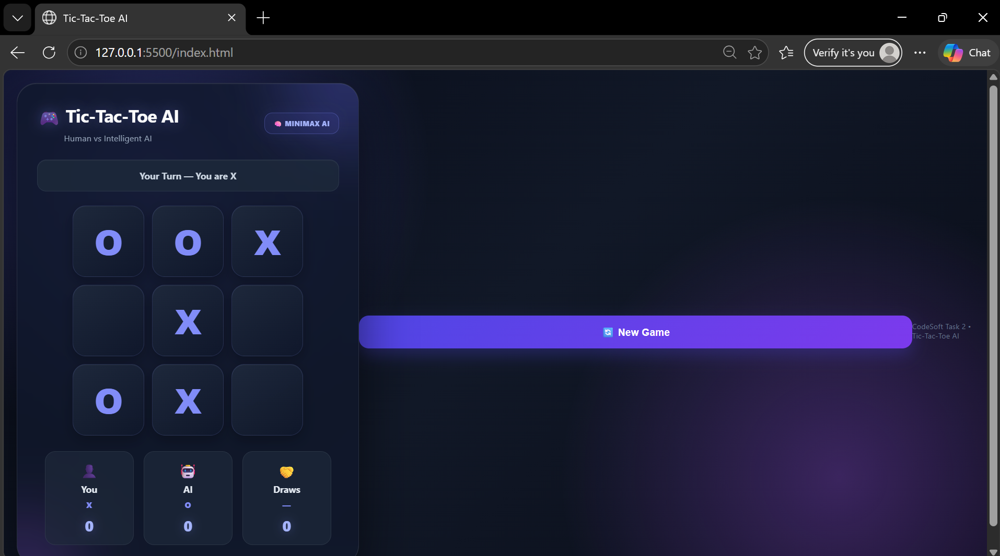

# 🎮 Tic-Tac-Toe AI

An interactive Tic-Tac-Toe game with an AI opponent, developed using HTML, CSS, and JavaScript.

This project was developed as **CodSoft Task 2**.

## 📌 Project Overview

Tic-Tac-Toe AI is a browser-based game where a player can play Tic-Tac-Toe against an AI opponent.

The project provides an interactive game board, player and AI turns, game status updates, and a clean modern interface.
## 🖥️ Project Screenshot



## ✨ Features

- 🎮 Interactive Tic-Tac-Toe game
- 🤖 AI opponent
- 👤 Player vs AI gameplay
- ⚡ Instant game responses
- 🏆 Win, lose, and draw detection
- 🔄 Restart game option
- 🎨 Modern and responsive UI
- 🌐 Runs directly in a web browser

## 🛠️ Technologies Used

- HTML5
- CSS3
- JavaScript
- Visual Studio Code

## 📂 Project Structure

```text
CodeSoft_Task_2/
│
├── index.html
├── style.css
├── script.js
├── CodeSoft_Task_2_Tic_Tac_Toe_AI.pptx
├── .gitignore
└── README.md

🚀 How to Run
Clone or download this repository.
Open the project folder in Visual Studio Code.
Open index.html in a web browser.
Start playing Tic-Tac-Toe against the AI.
🎯 Purpose

The purpose of this project is to demonstrate the development of an interactive browser-based game using front-end web technologies and JavaScript game logic.

👩‍💻 Developed By

Vajida Shaik

Developed as part of the CodSoft Internship – Task 2.